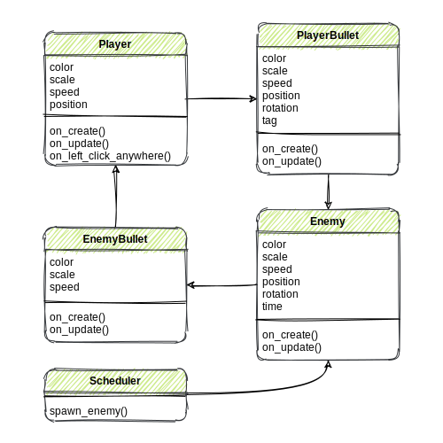

<link rel="stylesheet" type="text/css" media="all" href="style.css" />

# Final Project Student Webpage

Use this markdown file to write the contents of your webpage. Below is an outline for your project description and some suggestions and questions to answer. Some notes about how to use markdown can be found [here](markdown_notes.md).

## Overview

Introduce the project:
- Roughly describe what the user must do in your project.
- What is the goal? How to achieve it?
- Why is it interesting? 
- Make people want to read more about your project!

You have to jump on the different blocks.Then be careful your feet.If you fell into the hole.You die.Watch out your head.You might be hit on the ceiling.Then it has the"DOUBLE PLAYER MODE".You can play with your friend,or do something interesting.Like push your friends into the hole.Sounds good right?

To win this game.You have to stay alive for 3 minutes.But,if you fall into the bottom of the game,or touch the up of the game.GAME OVER.

Include some pictures, animated gifs or videos of your project in action.

## Implementation Details

Think and write about the structure of your solution and code. 

- How did you decompose the big problem into small manageable pieces? 
- What is the role of each sprite class? 
- How / when do the sprites interact or communicate with each other? 
- Explain the role of any important variables.

Include a decomposition diagram and the main role of each decomposed part. 

For the decomposition diagram, include each implemented class with their properties and methods and draw arrows between classes that interact with eachother. Draw by hand first. You can take a picture and add it to your page. If you want to draw the diagram digitally, you can use [diagrams.net](https://app.diagrams.net/) or any other software of your choice. Here is a [template](https://app.diagrams.net/#G1L7rig3DPeSpGgIQCM0IddXcho81k86jn) which you can use.
